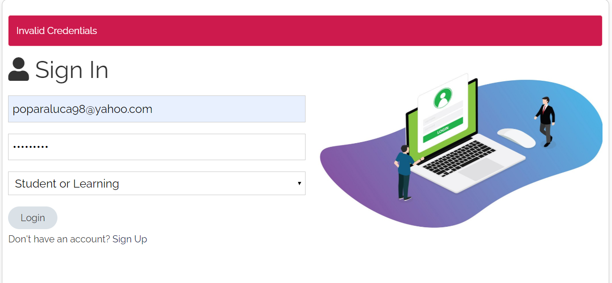
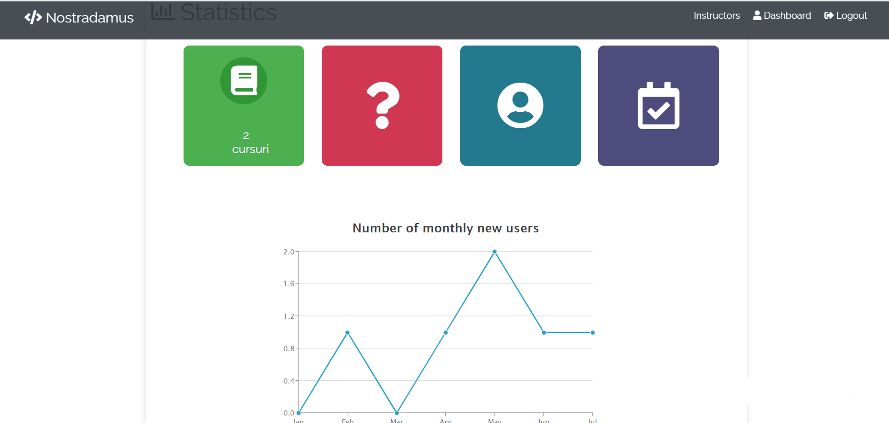
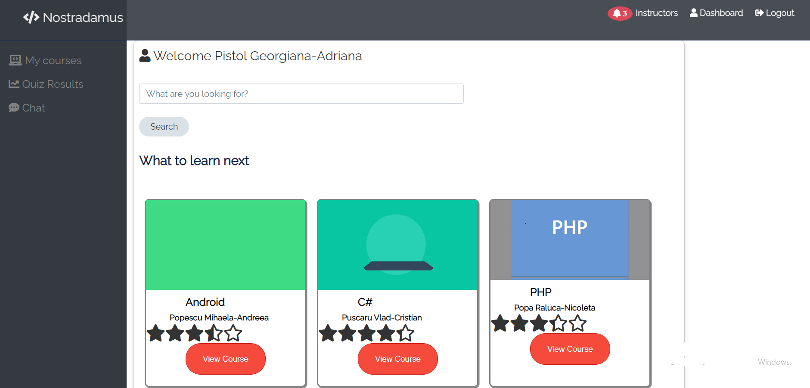
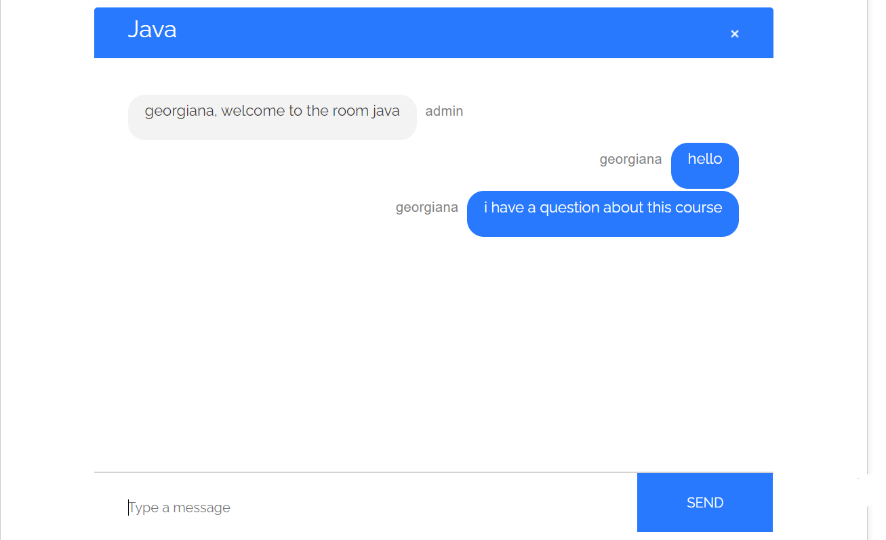

# E-Learning Platform
This is a simple web application that helps students to learn more about programming. 
## Available features
1. Users registration(teachers and students)
2. Video courses
3. Quiziz and assignments
4. Statistics
## How to run this app?
It's very easy to run this app. You must write into your terminal:
```bash
npm run dev
```
This app will be available at  http://localhost:3000
## How look this app?




